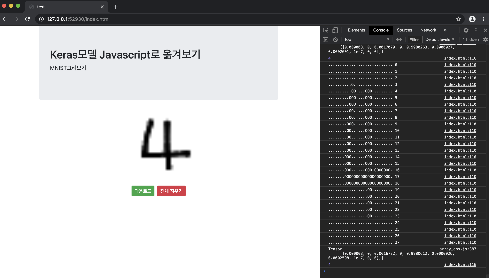

# keras-tfjs-mnist-example
Example of web visualization using tenserflow.js after learning with python and keras. (MNIST)  
SAI 인공지능 동아리를 위해서 만들어본 프로젝트 가이드 코드입니다.
- Main.ipython : 모델 학습과 생성은 python과 keras를 이용하여 할 수 있도록하였고 모델을 내보내기 할 수 있습니다.
- index.html : 내보내기 한 모델을 이용하여 웹으로 직접 숫자를 그려보며 실시간 예측을 체험해 볼 수 있습니다.

## 0. demo 실행
demo 폴더안에 있는 index.html을 실행하면 됩니다. (크롬 권장)

## 1. main 실행
모델이 생성됩니다.

## 2. index 실행
index에서 모델을 로드하여 실행됩니다. `F12`버튼을 눌러 개발자모드 콘솔에서 그림을 그릴때마다 실시간으로 예측 값이 갱신되는것을 볼 수 있습니다.  
(OSX는 `command+option+i` 입니다)
